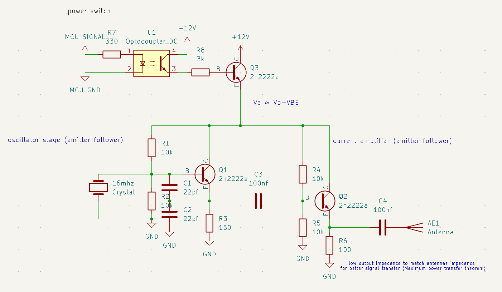
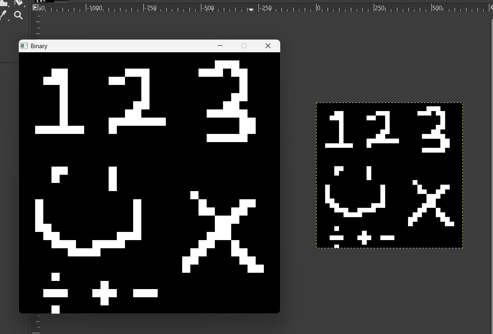

**required materials:**

&#x20;• a software defined radio and its software (sdr++ in this case)

&#x20;• a microcontroller and a Transmitter circuit

&#x20;• audio editing software

**Circuit schematic**

**How to setup:**

&#x20;• draw your image using the program contained in the folder called "BinaryImageTotextFile"

&#x20;• use right click to draw pixels and left click to delete pixels

&#x20;• press space to save the data to the file(overwrites data to a pre existing file if it exists)

&#x20;• pressing space writes data to a file, this can only be done once as to prevent additional data from being written to a single file

&#x20;• on the Software Defined Radio software set the signal decoding to CW and set the tone frequency to the highest value but less than or equal to half the audio sample rate(Nyquist-shannon sampling theorem), 1250Hz tone used in my setup

once everything is setup you will have the binary image as a text file in the folder directory "BinaryImageToTextFile\output"

open the file and copy all of the data inside.

Next open the .ino file in the folder directory "BinaryOutputToMcu" and delete the elements of the "ByteArray" if there is existing data to begin with.

once the array is empty copy all of the data from the binary image text file to the array once.

next plug in your desired micro controller and upload the code then wire the digital write pin to the optocoupler anode(must use a current limiting resistor typically in the range of 220 ohms - 2k) and the micro controller ground hooked up to the optocoupler cathode.

when all of these steps are done turn on the transmitter and Micro controller to begin transmitting data over the air and use your Software Defined Radio to record the data

to a .wav file

**How to process the .wav file**:

&#x20;open the file in the desired audio editing program and align the left side crop to the exact start of the first preamble bit

&#x20;when done cropping the audio file save it in the "AudioData" directory, and in the program change the string location to "AudioData/YourFileName.wav"

&#x20;Lastly, adjust the threshold value(if needed) until the resulting image looks correct

*Audacity*

**Audio transmission file playback**

https://github.com/user-attachments/assets/091821d0-745c-4fe8-9bf1-b915e47a6ad6

**Decoded data & side by side image comparsion**

*the left image is the decoded data sent over air*

*the right image is the original image used as the source for transmisson over the air*

**extra information**:

&#x20;• the preamble and postamble contains 8 bits where all bits are on (used as the cropping reference)

• the transmitter has a bit width of 25ms meaning that it transmits at 40bits/second (1000ms/25ms= 40bits/second) and the time for a full transmisson is defined by this equation (imageBitSize+preambleSize+postambleSize)/ bits per second

• the bit width can be reduced for faster data transfer but due to circuit limitations it might not give the expected result due to voltage not ramping fast enough (best signal quality @ 25ms bit width)

